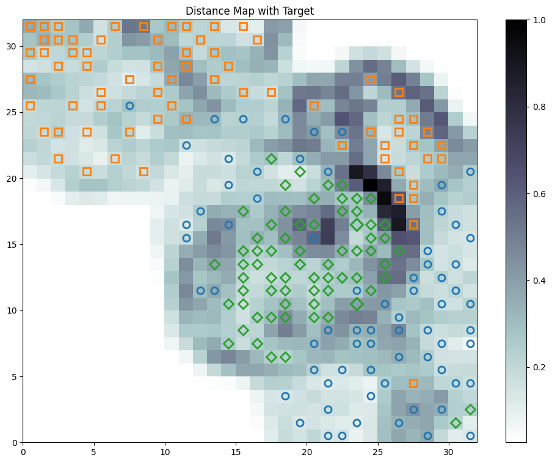
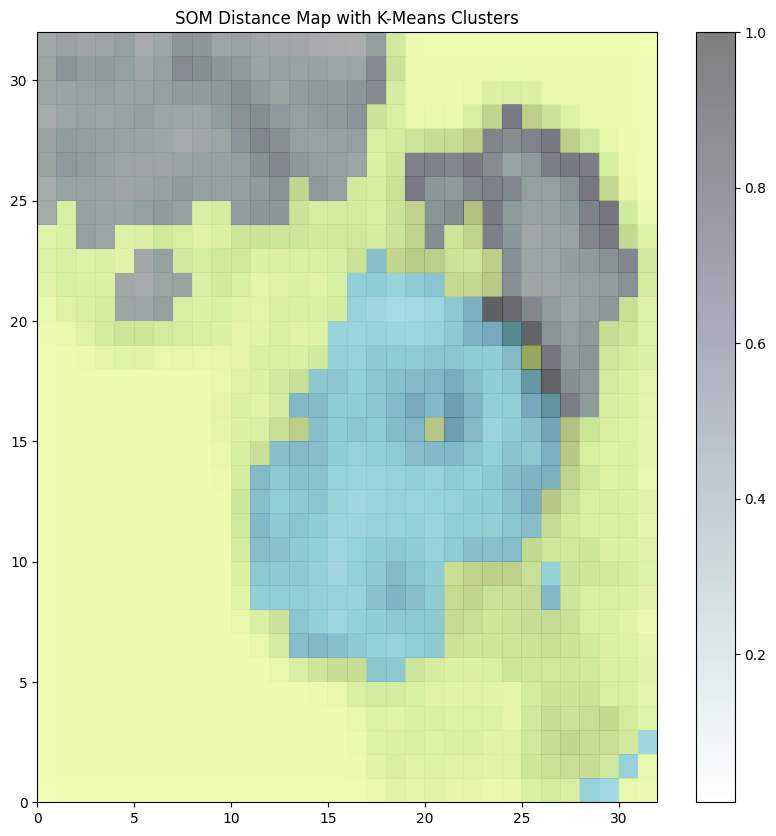
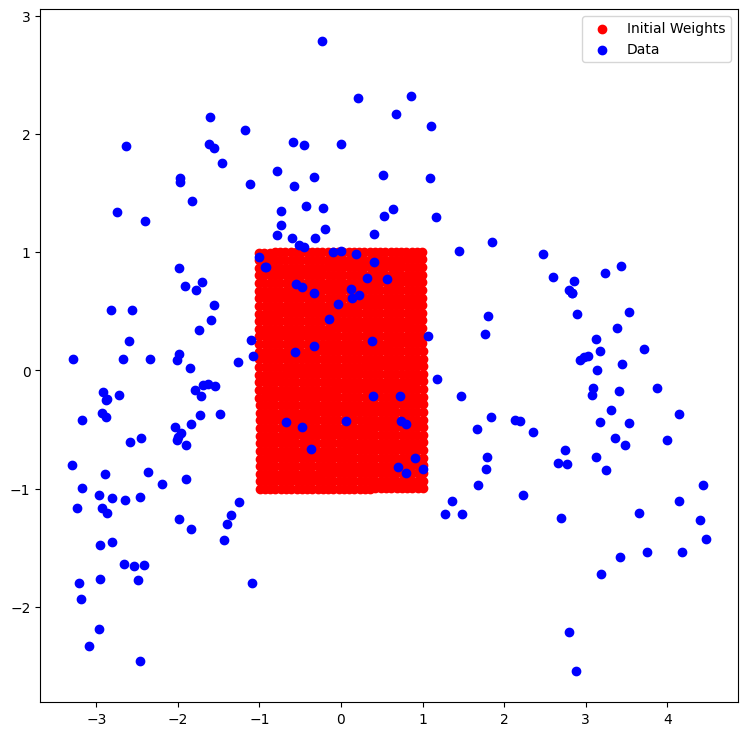
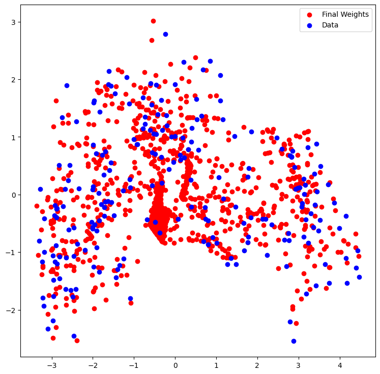

## A quick guide on Self Organizing Maps (SOMs) 
I found myself studying SOMs, mainly through [Essentials of the Self-Organizing Map, 2013](https://www.sciencedirect.com/science/article/pii/S0893608012002596?casa_token=hzYPuGoTcrcAAAAA:OE7Y_sbiwacwkHZziG5N3R9Tov4ptvDocKGLt5CH4bQ1un3agbRiHgvDB9xxPzdscGALcHlmyQ) by Teuvo Kohonen.

The main obstacle I faced was a clear way to tune the hyperparameters of the SOM. This guide is a summary of the main points I found useful to understand SOMs and how to tune them.

I will assume you have a basic understanding of SOMs. If you don't, I recommend reading the paper mentioned above.

### 1. Metrics of efficiency
#### 1.1 Quantization error
Quantization error is the main metrics to be looked at when tuning the hyperparameters. It represents the average distance between each input vector and its corresponding winning neuron. If the quantization error is 0, then the SOM perfectly represents the input data.

Formula:
\[
QE = \frac{1}{N} \sum_{i=1}^{N} ||x_i - w_{c,i}||
\]

where:
- $N$ is the number of observations
- $x_i$ is the $i$-th sample
- $w_{c,i}$ is the weight vector of the winner neuron for the $i$-th sample
- $QE$ is the quantization error
- $|| \cdot ||$ is the Euclidean distance

"The Quantization Error [...], declines as the map becomes larger. [...] Thus, the Quantization Error cannot be used to compare maps of different sizes." ([Pölzlbauer, 2005](https://www.ifs.tuwien.ac.at/~poelzlbauer/publications/Poe04WDA.pdf))

Based on this principle, we will tune the hyperparameters based on maps of equal size.

#### 1.2 Topographic error
Last but not least, the topographic error is calculated as the fraction of samples whose best and second-best matching units are not neighbors on the map. Formula retrived from [[Forest, 2020](https://arxiv.org/abs/2011.05847)][^1]:

\[
\text{TE} = \frac{1}{N} \sum_{i=1}^{N} \mathbf{1}_{\delta(b1_i, b2_i) > 1}
\]

where:
- $N$ is the number of samples
- $\mathbf{1}_{\delta(b1_i, b2_i) > 1}$ is the indicator function that is 1 if the first and second best matching units are not adjacent, 0 otherwise

Even though we will not use the topographic error to tune the hyperparameters, it is a good metric to evaluate the quality of the map. And, as we will do, we will always check its value after the training.

[^1]: The orginal formula is in reality much older, and can be referred to [Kiviluoto, 1996](https://ieeexplore.ieee.org/abstract/document/548907?casa_token=GC4PR4uFbQgAAAAA:kssZwGax7MpnlEvmcaTC_Q_S4BFImqGdrq6bIYc4Oa9TcoTGK2AbFQl1NZtArkrbw_w7vmeKB8Mn)

### 2. About the Number of Neurons
Some good heuristic to determine the number of neurons is, based on [Vesanto, 2005](http://www.cis.hut.fi/projects/somtoolbox/documentation/somalg.shtml), the following:
$$
n_{neurons} = 5 \times \sqrt{N}
$$
where:
- $N$ is the number of observations

### 3. Hyperparameters
There are two main hyperparameters to be tuned:
- The learning rate $\alpha$
- The neighborhood function $\sigma$

Using the class `HyperparameterTuning` we can perform a grid search to find the best hyperparameters, based on the quantization error metric. The class uses the `minisom` package.

Example usage:
```python
from src.utils.Hyperparameter import HyperparameterTuning

tuning = HyperparameterTuning() # If n_neurons is not passed, it will be calculated based on the heuristic mentioned above
best_params = tuning.run()

print(best_params)
```

### 4. Visualization

Moreover, we can visualize the map using the class `Visualization`. Besides the classical U-matrix, we can visualize the following:

#### U-matrix Visualizations
<div style="display: flex; justify-content: space-between;">
    <div style="text-align: center;">
        
        <p>U-matrix with target</p>
    </div>
    <div style="text-align: center;">
        
        <p>U-matrix with k-means clustering</p>
    </div>
</div>

#### PCA Visualizations
<div style="display: flex; justify-content: space-between;">
    <div style="text-align: center;">
        
        <p>Initial weights under PCA with target</p>
    </div>
    <div style="text-align: center;">
        
        <p>Final weights under PCA with target</p>
    </div>
</div>

##### Final Note
An example of how to use the 2 classes can be found in the `notebooks` folder.


